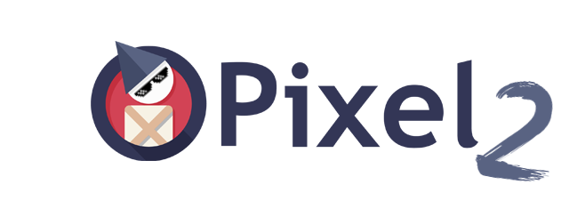

# __**Important Notice **__
Revived fork of the original [Pixel](https://github.com/faiface/pixel) library by [faiface](https://github.com/faiface). This fork is intended to be a community-driven effort to continue the development of the library. We were unable to get a hold of the original author, to take ownership of the original repository to carry on the legacy of the wonderful work. If you are interested in contributing, please join us in the [Discord Chat!](https://discord.gg/D6mQ8Pnm)


<p align="center"></p>


# Pixel 2 [](https://travis-ci.org/faiface/pixel) [](https://godoc.org/github.com/duysqubix/pixel2) [](https://goreportcard.com/report/github.com/duysqubix/pixel2) [](https://gitter.im/pixellib/Lobby?utm_source=badge&utm_medium=badge&utm_campaign=pr-badge&utm_content=badge) [](https://discord.gg/q2DK4MP)  

A hand-crafted 2D game library in Go. Take a look into the [features](#features) to see what it can
do.

```
go get github.com/duysqubix/pixel2
```

If you are using Modules (Go 1.11 or higher) and want a mutable copy of the source code:

```
git clone https://github.com/duysqubix/pixel2 # clone outside of $GOPATH
cd pixel2
go install ./...
```

See [requirements](#requirements) for the list of libraries necessary for compilation.

Take a look at [CHANGELOG.md](CHANGELOG.md) for upcoming releases and history.

## Tutorial

The [Wiki of this repo](https://github.com/duysqubix/pixel2/wiki) contains an extensive tutorial
covering several topics of Pixel. Here's the content of the tutorial parts so far:

- [Creating a Window](https://github.com/duysqubix/pixel2/wiki/Creating-a-Window)
- [Drawing a Sprite](https://github.com/duysqubix/pixel2/wiki/Drawing-a-Sprite)
- [Moving, scaling and rotating with Matrix](https://github.com/duysqubix/pixel2/wiki/Moving,-scaling-and-rotating-with-Matrix)
- [Pressing keys and clicking mouse](https://github.com/duysqubix/pixel2/wiki/Pressing-keys-and-clicking-mouse)
- [Drawing efficiently with Batch](https://github.com/duysqubix/pixel2/wiki/Drawing-efficiently-with-Batch)
- [Drawing shapes with IMDraw](https://github.com/duysqubix/pixel2/wiki/Drawing-shapes-with-IMDraw)
- [Typing text on the screen](https://github.com/duysqubix/pixel2/wiki/Typing-text-on-the-screen)
- [Using a custom fragment shader](https://github.com/duysqubix/pixel2/wiki/Using-a-custom-fragment-shader)

## [Examples](https://github.com/faiface/pixel-examples)

The [examples](https://github.com/faiface/pixel-examples) repository contains a few
examples demonstrating Pixel's functionality.

**To run an example**, navigate to it's directory, then `go run` the `main.go` file. For example:

```
$ cd pixel-examples/platformer
$ go run main.go
```

Here are some screenshots from the examples!

| [Lights](https://github.com/faiface/pixel-examples/blob/master/lights) | [Platformer](https://github.com/faiface/pixel-examples/blob/master/platformer) |
| --- | --- |
|  |  |

| [Smoke](https://github.com/faiface/pixel-examples/blob/master/smoke) | [Typewriter](https://github.com/faiface/pixel-examples/blob/master/typewriter) |
| --- | --- |
|  |  |

| [Raycaster](https://github.com/faiface/pixel-examples/blob/master/community/raycaster) | [Gizmo](https://github.com/Lallassu/gizmo) |
| --- | --- |
|  |  |

## Release Schedule
We aim to release a new version the 1st of every month.

## Features

Here's the list of the main features in Pixel. Although Pixel is still under heavy development,
**there should be no major breakage in the API.** This is not a 100% guarantee, though.

- Fast 2D graphics
  - Sprites
  - Primitive shapes with immediate mode style
    [IMDraw](https://github.com/duysqubix/pixel2/wiki/Drawing-shapes-with-IMDraw) (circles, rectangles,
    lines, ...)
  - Optimized drawing with [Batch](https://github.com/duysqubix/pixel2/wiki/Drawing-efficiently-with-Batch)
  - Text drawing with [text](https://godoc.org/github.com/duysqubix/pixel2/text) package
- Audio through a separate [Beep](https://github.com/faiface/beep) library.
- Simple and convenient API
  - Drawing a sprite to a window is as simple as `sprite.Draw(window, matrix)`
  - Wanna know where the center of a window is? `window.Bounds().Center()`
  - [...](https://godoc.org/github.com/duysqubix/pixel2)
- Full documentation and tutorial
- Works on Linux, macOS and Windows
- Window creation and manipulation (resizing, fullscreen, multiple windows, ...)
- Keyboard (key presses, text input) and mouse input without events
- Well integrated with the Go standard library
  - Use `"image"` package for loading pictures
  - Use `"time"` package for measuring delta time and FPS
  - Use `"image/color"` for colors, or use Pixel's own `color.Color` format, which supports easy
    multiplication and a few more features
  - Pixel uses `float64` throughout the library, compatible with `"math"` package
- Geometry transformations with
  [Matrix](https://github.com/duysqubix/pixel2/wiki/Moving,-scaling-and-rotating-with-Matrix)
  - Moving, scaling, rotating
  - Easy camera implementation
- Off-screen drawing to Canvas or any other target (Batch, IMDraw, ...)
- Fully garbage collected, no `Close` or `Dispose` methods
- Full [Porter-Duff](http://ssp.impulsetrain.com/porterduff.html) composition, which enables
  - 2D lighting
  - Cutting holes into objects
  - Much more...
- Pixel let's you draw stuff and do your job, it doesn't impose any particular style or paradigm
- Platform and backend independent [core](https://godoc.org/github.com/duysqubix/pixel2)
- Core Target/Triangles/Picture pattern makes it easy to create new drawing targets that do
  arbitrarily crazy stuff (e.g. graphical effects)
- Small codebase, ~5K lines of code, including the backend [glhf](https://github.com/faiface/glhf)
  package

 ## Related repositories

 Here are some packages which use Pixel:
 - [TilePix](https://github.com/bcvery1/tilepix) Makes handling TMX files built with [Tiled](https://www.mapeditor.org/) trivially easy to work with using Pixel.
 - [spriteplus](https://github.com/cebarks/spriteplus) Basic `SpriteSheet` and `Animation` implementations
 - [PixelUI](https://github.com/dusk125/pixelui) Imgui-based GUIs for Pixel
 - [pixelutils](https://github.com/dusk125/pixelutils) Variety of game related utilities (sprite packer, id generator, ticker, sprite loader, voronoia diagrams)

## Missing features

Pixel is in development and still missing few critical features. Here're the most critical ones.

- ~~Audio~~
- ~~Drawing text~~
- Antialiasing (filtering is supported, though)
- ~~Advanced window manipulation (cursor hiding, window icon, ...)~~
- Better support for Hi-DPI displays
- Mobile (and perhaps HTML5?) backend
- ~~More advanced graphical effects (e.g. blur)~~ (solved with the addition of GLSL effects)
- Tests and benchmarks
- Vulkan support

**Implementing these features will get us to the 1.0 release.** Contribute, so that it's as soon as
possible!

## Requirements

If you're using Windows and having trouble building Pixel, please check [this
guide](https://github.com/duysqubix/pixel2/wiki/Building-Pixel-on-Windows) on the
[wiki](https://github.com/duysqubix/pixel2/wiki).

[PixelGL](https://godoc.org/github.com/duysqubix/pixel2/pixelgl) backend uses OpenGL to render
graphics. Because of that, OpenGL development libraries are needed for compilation. The dependencies
are same as for [GLFW](https://github.com/go-gl/glfw).

The OpenGL version used is **OpenGL 3.3**.

- On macOS, you need Xcode or Command Line Tools for Xcode (`xcode-select --install`) for required
  headers and libraries.
- On Ubuntu/Debian-like Linux distributions, you need `libgl1-mesa-dev` and `xorg-dev` packages.
- On CentOS/Fedora-like Linux distributions, you need `libX11-devel libXcursor-devel libXrandr-devel
  libXinerama-devel mesa-libGL-devel libXi-devel libXxf86vm-devel` packages.
- See [here](http://www.glfw.org/docs/latest/compile.html#compile_deps) for full details.

**The combination of Go 1.8, macOS and latest XCode seems to be problematic** as mentioned in issue
[#7](https://github.com/duysqubix/pixel2/issues/7). This issue is probably not related to Pixel.
**Upgrading to Go 1.8.1 fixes the issue.**

## Contributing

Join us in the [Discord Chat!](https://discord.gg/D6mQ8Pnm)

Pixel is currently in a developmental phase, with many of its key features already in place, while others are still in the works. 
We genuinely appreciate and value contributions, as they can significantly expedite the development process. I invite everyone to 
contribute in any way they can, even if it's just sharing an idea. We especially value the submission of issues and pull requests.

That said, it's **important to remember that Pixel is being developed with a great deal of thought and attention to detail**. Each component 
has gone through numerous design iterations to ensure quality. We place a high premium on code and API quality, with an emphasis on simplicity and expressiveness.
When contributing, please bear these goals in mind. This doesn't mean that only flawless pull requests will be accepted. Rather, it 
means that there may be times when a proposal might not align with our vision, or when a pull request might require some revisions. 
This is completely normal and should not discourage you. After all, our shared goal is to achieve the best end result possible.

Take a look at [CONTRIBUTING.md](CONTRIBUTING.md) for further information.

## License

[MIT](LICENSE)

## Special Contributions

- A significant shoutout to the original author [faiface](https://github.com/faiface) for starting and growing the Pixel community. We would not be here if not for him.
- The active/inactive maintainers of the original Pixel repo:
    - [dusk125](https://github.com/dusk125)
    - [cebarks](https://github.com/cebarks)
    - [Benjyclay](https://github.com/Benjyclay)
    - [delp](https://github.com/delp)
    - [roipoussiere](https://github.com/roipoussiere)
