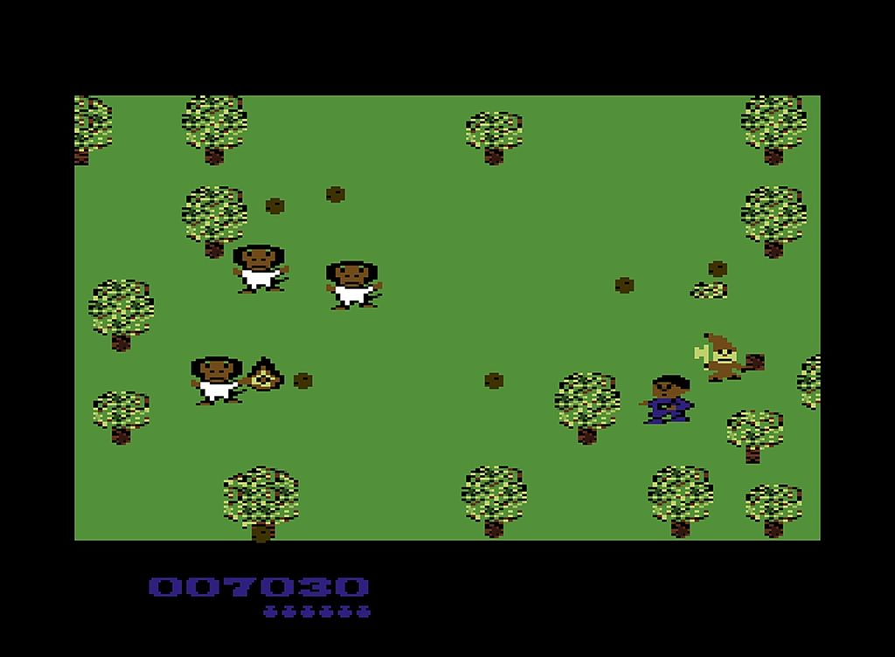
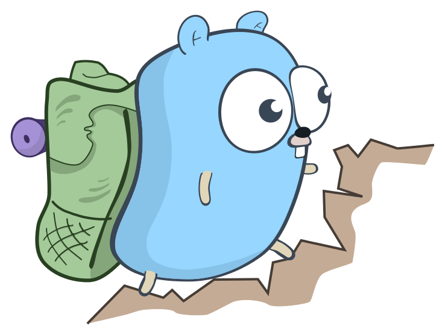
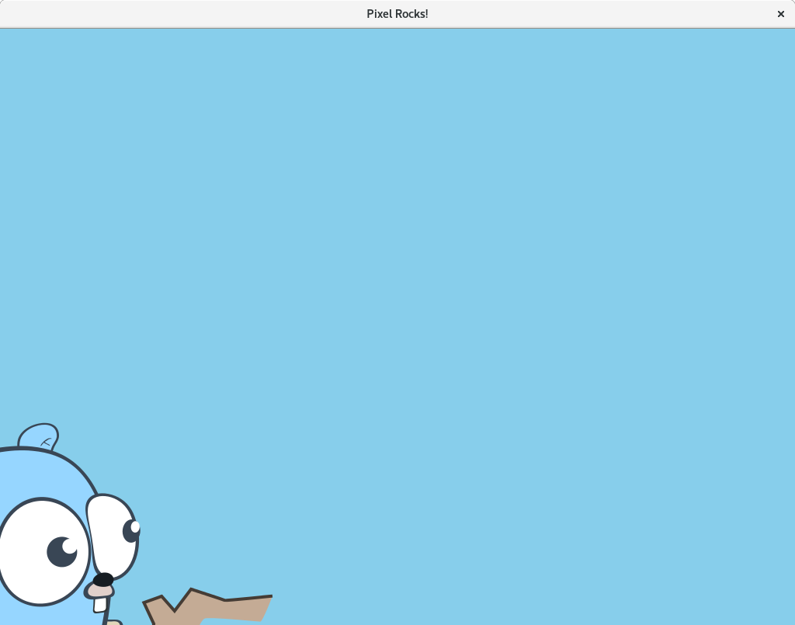
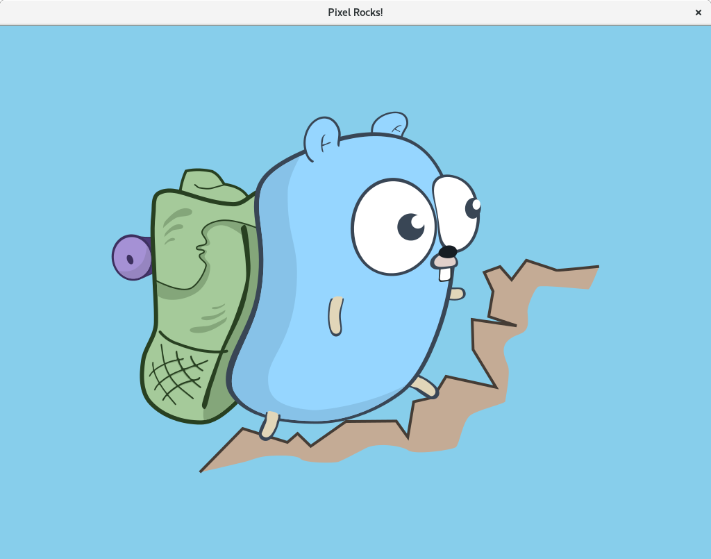
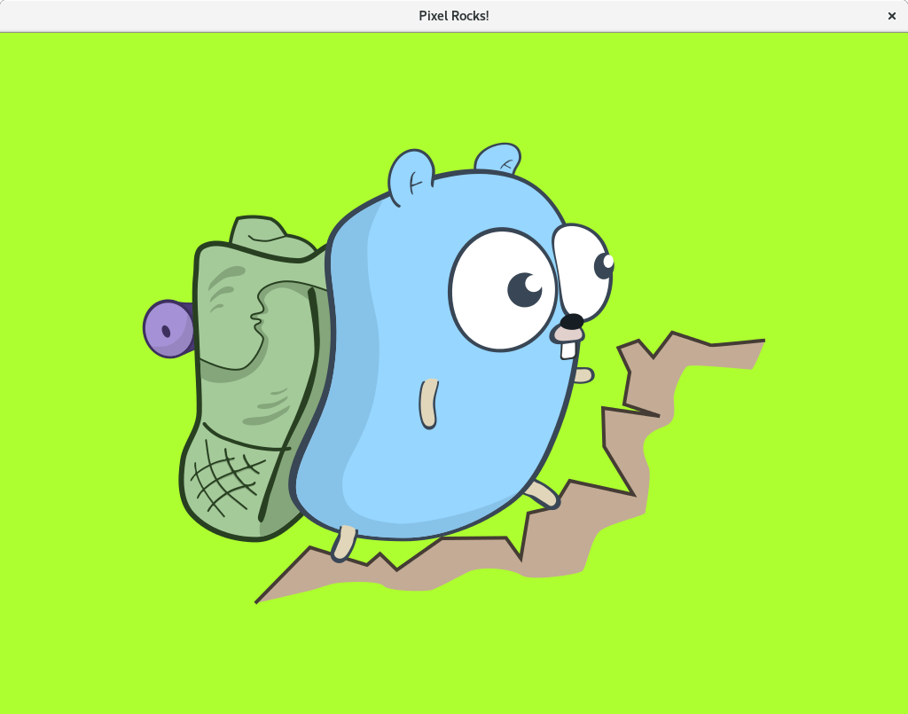

[Previous Tutorial](./Creating-a-Window.md)

In this part, we'll learn how draw pictures on the screen using sprites.

## What's sprite?

[Sprite](https://en.wikipedia.org/wiki/Sprite_(computer_graphics)) is an ancient concept in video game development. In the old times, a sprite was usually a 16x16px or 32x32px "stamp" that could be stamped on the screen. One sprite could be the picture of the player, more sprites could be used to display enemies and platforms, and so on. This allowed efficient drawing of complicated scenes. Here's a screenshot from an old C64 game shamelessly stolen from [Wikipedia](https://en.wikipedia.org/wiki/Main_Page).



Today, sprites still follow the same concept, however, allow for much wider range of possibilities. A sprite is basically a picture, which can be drawn somewhere on the screen. In Pixel, as we'll learn later, sprites (alongside all other graphical objects) can be drawn not only to the screen, but onto an arbitrary [Target](https://godoc.org/github.com/gopxl/pixel/v2#Target).

## Previous part

We'll start off with the code from the end of the [previous part](https://github.com/gopxl/pixel/wiki/Creating-a-Window).

```go
package main

import (
	"github.com/gopxl/pixel/v2"
	"github.com/gopxl/pixel/v2/backends/opengl"
	"golang.org/x/image/colornames"
)

func run() {
	cfg := opengl.WindowConfig{
		Title:  "Pixel Rocks!",
		Bounds: pixel.R(0, 0, 1024, 768),
		VSync:  true,
	}
	win, err := opengl.NewWindow(cfg)
	if err != nil {
		panic(err)
	}
	defer win.Destroy()

	win.Clear(colornames.Skyblue)

	for !win.Closed() {
		win.Update()
	}
}

func main() {
	opengl.Run(run)
}
```

## Picture

Before we can draw any sprites, we first need to have some pictures to create the sprites from. If you scroll through the Pixel documentation, you'll find [this function](https://godoc.org/github.com/gopxl/pixel/v2#PictureDataFromImage).

```go
func PictureDataFromImage(img image.Image) *PictureData
```

What's [PictureData](https://godoc.org/github.com/gopxl/pixel/v2#PictureData)? Well, don't get scared, it's simple. In Pixel, pictures can have a large variety of forms. There are pictures stored in the memory, there are pictures stored in the video memory, and so on. What does this hint? Yes, there's an interface called [Picture](https://godoc.org/github.com/gopxl/pixel/v2#Picture). To create a sprite, we just need a picture of any form, and `PictureData` is the simplest one to obtain, it's just some pixels stored in the memory. Also, as you can see, we can create it from the standard Go's [image.Image](https://golang.org/pkg/image/#Image).

So, we first need to load an `image.Image`. If you're not familiar with the [image](https://golang.org/pkg/image/) package from the standard library, I highly recommend you read [this article](https://blog.golang.org/go-image-package).

First, we need to import the `"image"` package and we also need to "underscore import" the `"image/png"` package to load PNG files. We also need to import the `"os"` package to load files from the filesystem.

```go
import (
	"image"
	"os"

	_ "image/png"

	"github.com/gopxl/pixel/v2"
	"github.com/gopxl/pixel/v2/backends/opengl"
	"golang.org/x/image/colornames"
)
```

Next, we'll write a short helper function to load pictures.

```go
func loadPicture(path string) (pixel.Picture, error) {
	file, err := os.Open(path)
	if err != nil {
		return nil, err
	}
	defer file.Close()
	img, _, err := image.Decode(file)
	if err != nil {
		return nil, err
	}
	return pixel.PictureDataFromImage(img), nil
}
```

Let's break down this function. First, it opens a file using the `"os"` package. We mustn't forget to close the file. Second, we decode the image file using the `"image"` package. In our case, we can only decode PNG files, since we've only imported `"image/png"`. If we've wanted to be able to load and decode more formats, we'd need to import the respective packages (such as `"image/jpeg"` for decoding JPEG files). Finally, we convert the `image.Image` to `PictureData` using the `pixel.PictureDataFromImage` function. Notice, that the return type is just `pixel.Picture`. There's no good reason for that, it simply doesn't matter. All we want is to create a sprite from the returned picture, so a generic `Picture` is sufficient.

_Pardon the rather complicated nature of loading a picture from a file in Pixel. It might get simpler someday, I just haven't figured out the right way yet._

Now, we need an actual PNG file to load a picture from. I'll use a beautiful hiking gopher from [this repo](https://github.com/egonelbre/gophers), which contains many free beautiful images of gophers in various situations of their life. You can download an image from there, or directly use this one, which I'll use.



Just download the PNG image file into the directory of your Go program. Now, we're ready to load it.

```go
func run() {
	cfg := opengl.WindowConfig{
		Title:  "Pixel Rocks!",
		Bounds: pixel.R(0, 0, 1024, 768),
		VSync:  true,
	}
	win, err := opengl.NewWindow(cfg)
	if err != nil {
		panic(err)
	}

	pic, err := loadPicture("hiking.png")
	if err != nil {
		panic(err)
	}
```

We load the picture and panic if an error occurred while loading it. Panicking is sufficient in this situation, since the file should just be there. In a real game, a more sophisticated error handling would be appropriate.

## Sprite

Now that we've loaded a picture, we're ready to create a sprite.

```go
	pic, err := loadPicture("hiking.png")
	if err != nil {
		panic(err)
	}

	sprite := pixel.NewSprite(pic, pic.Bounds())
```

Let's break down this line. We're using the function [pixel.NewSprite](https://godoc.org/github.com/gopxl/pixel/v2#NewSprite), which we've never seen before. This function, as we can tell, creates a new sprite from a picture. The first argument to this function is the picture itself. No wonders here. What's the second argument? The second argument is a rectangular portion of the picture that we want our sprite to draw. Since we want to draw the whole picture, we just use `pic.Bounds()`.

Now we're ready to draw the sprite to the window. Drawing a sprite is accomplished with a `sprite.Draw` method, which takes two arguments: target and matrix.

Target is obvious, it's where we want our sprite to be drawn. In our case, it's the window. The matrix allows for moving, rotating, scaling and more. We'll learn more about it later. For now, just know that `pixel.IM` means "no spacial transformations".

```go
	sprite := pixel.NewSprite(pic, pic.Bounds())

	win.Clear(colornames.Skyblue)
	sprite.Draw(win, pixel.IM)

	for !win.Closed() {
		win.Update()
	}
```

Wonderful! Let's run the code now. If you didn't make any mistakes and you have the PNG file in the right directory, you should see this.



## Matrix

That's not very good. Our sprite's got drawn to the lower-left corner of the window and we can't even see all of it. Why is that?

Since we only passed `pixel.IM` as the matrix argument, we didn't apply any transformations. Because of that, the sprite got drawn to the default position (0, 0), which in our case is the lower-left corner of the window (the y-axis increases upwards). Also, sprites are anchored by their center, that's why we're able to see the upper-right quadrant of the sprite.

To move the sprite to a different position, we need to pass a different matrix. No scary stuff here, [Matrix](https://godoc.org/github.com/gopxl/pixel/v2#Matrix) is the way Pixel handles transformations, such as movement, rotations and scaling in a very convenient way. We'll learn a lot more about it in the next part.

```go
	sprite := pixel.NewSprite(pic, pic.Bounds())

	win.Clear(colornames.Skyblue)

	sprite.Draw(win, pixel.IM.Moved(win.Bounds().Center()))
```

Calling [pixel.IM.Moved](https://godoc.org/github.com/gopxl/pixel/v2#Matrix.Moved) adds a movement to the matrix. As you can tell, we moved the sprite to the center of the window's bounds, which is the center of the window. Let's run the code now!



And just for the sake of freshness, let's change the background color.

```go
	win.Clear(colornames.Greenyellow)
```



In the next part, we'll learn how to move, rotate and scale sprites using the matrix and also how to add vectors using the + operator and many more things. Things will be moving, dynamically!

Here's the whole code of the program from this part.

```go
package main

import (
	"image"
	"os"

	_ "image/png"

	"github.com/gopxl/pixel/v2"
	"github.com/gopxl/pixel/v2/backends/opengl"
	"golang.org/x/image/colornames"
)

func loadPicture(path string) (pixel.Picture, error) {
	file, err := os.Open(path)
	if err != nil {
		return nil, err
	}
	defer file.Close()
	img, _, err := image.Decode(file)
	if err != nil {
		return nil, err
	}
	return pixel.PictureDataFromImage(img), nil
}

func run() {
	cfg := opengl.WindowConfig{
		Title:  "Pixel Rocks!",
		Bounds: pixel.R(0, 0, 1024, 768),
		VSync:  true,
	}
	win, err := opengl.NewWindow(cfg)
	if err != nil {
		panic(err)
	}

	pic, err := loadPicture("hiking.png")
	if err != nil {
		panic(err)
	}

	sprite := pixel.NewSprite(pic, pic.Bounds())

	win.Clear(colornames.Greenyellow)

	sprite.Draw(win, pixel.IM.Moved(win.Bounds().Center()))

	for !win.Closed() {
		win.Update()
	}
}

func main() {
	opengl.Run(run)
}
```

[Next Tutorial](./Moving,-scaling-and-rotating-with-Matrix.md)
