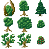
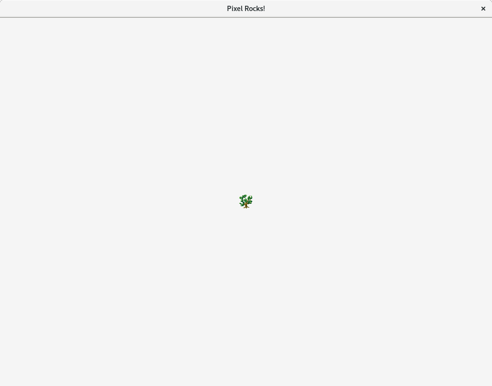
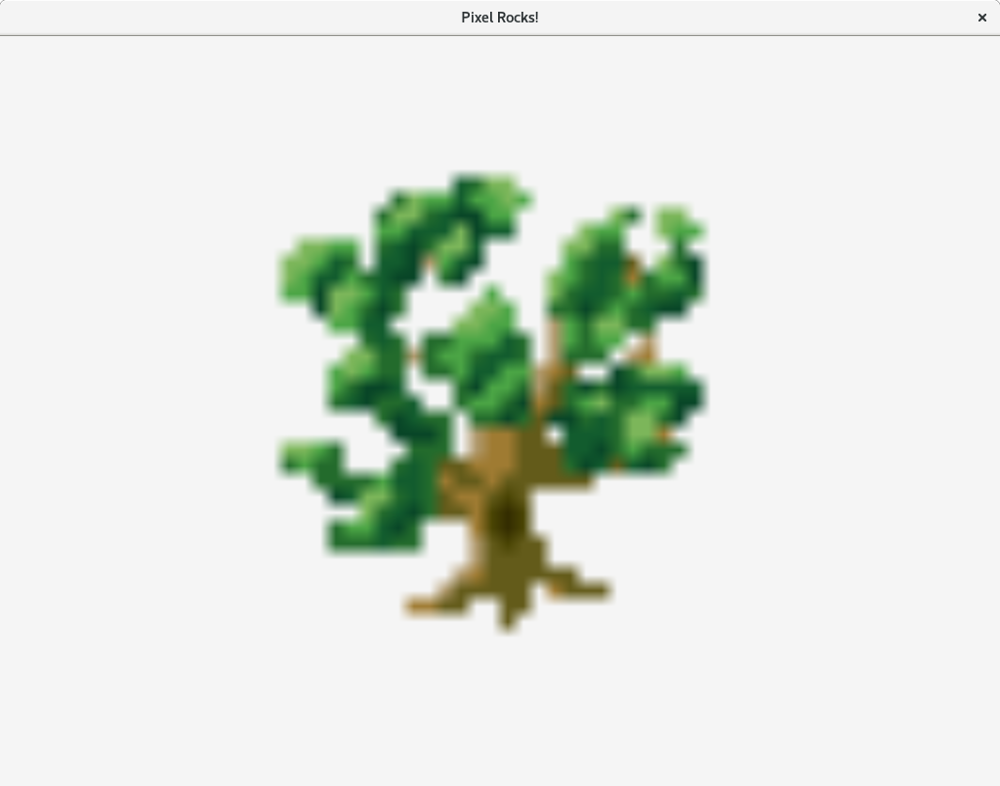
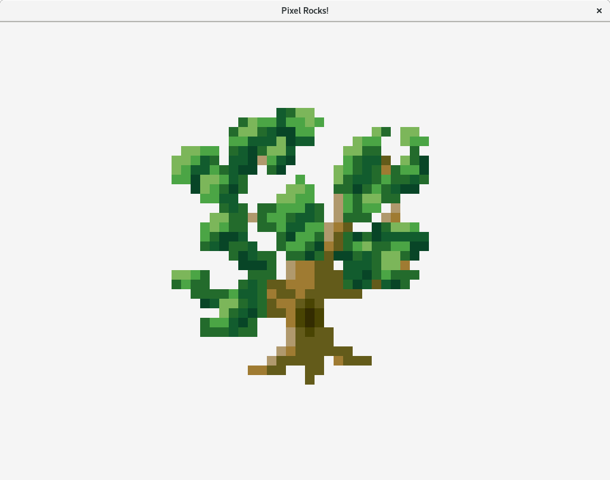
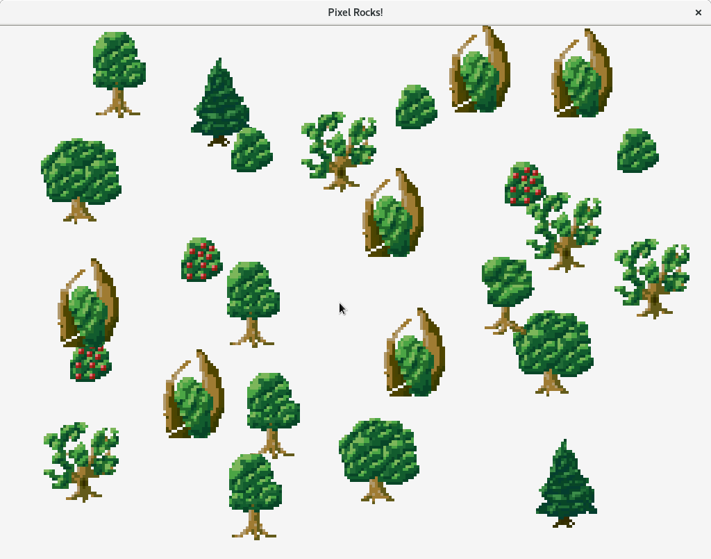
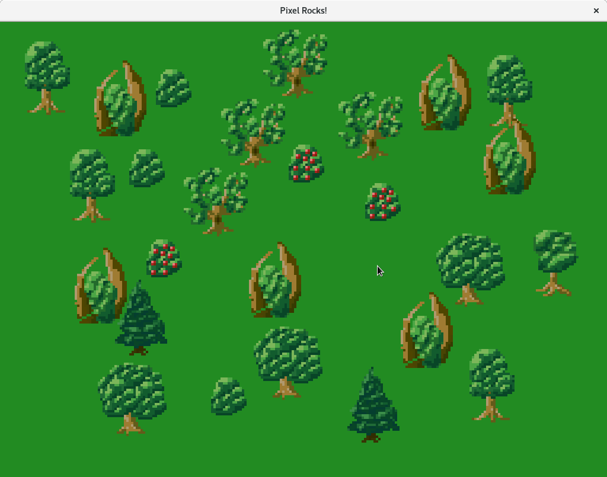
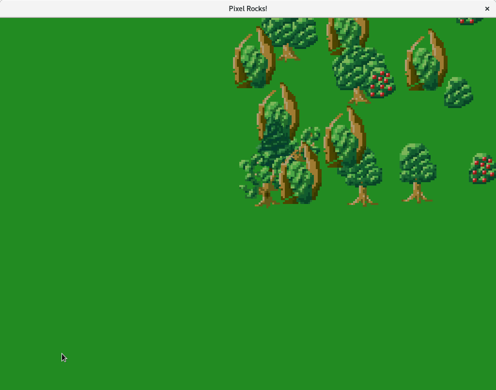
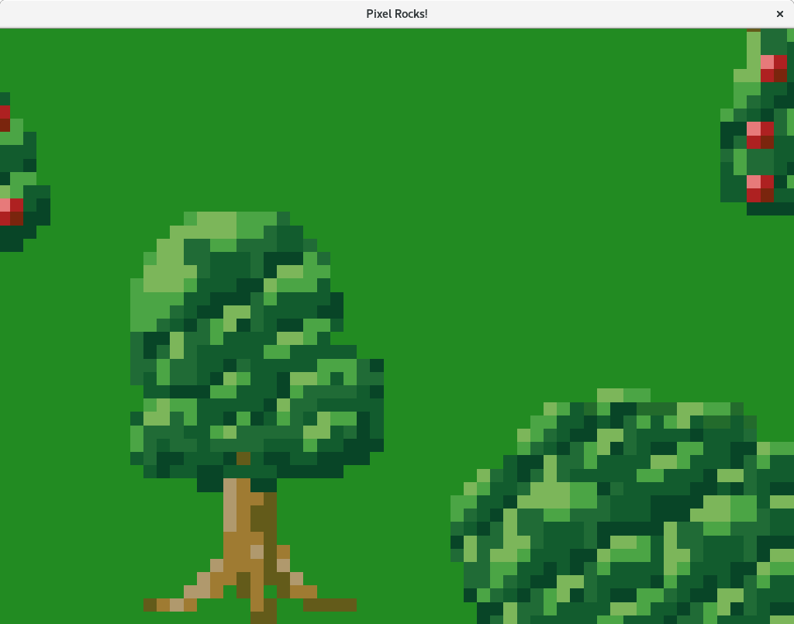
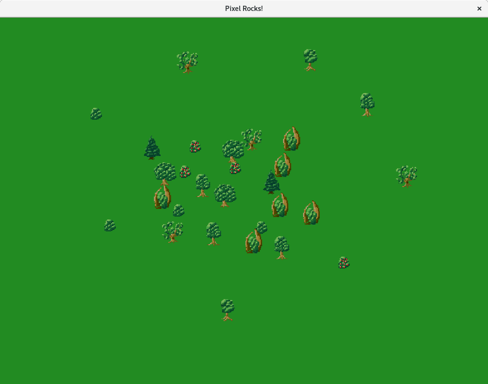

[Previous Tutorial](./Moving,-scaling-and-rotating-with-Matrix.md)

In this part, we'll learn how to handle keyboard and mouse input from the player and utilize it to plant trees and move camera to look around the forest.

## Starting off

So far, we've learned how to create windows, load pictures and draw sprites, even move them. But we didn't have any control over them, except through the code. That's about to change right now. Let's start with this code, you should be able to understand every single line of it, by now.

```go
package main

import (
	"image"
	"os"

	_ "image/png"

	"github.com/gopxl/pixel/v2"
	"github.com/gopxl/pixel/v2/backends/opengl"
	"golang.org/x/image/colornames"
)

func loadPicture(path string) (pixel.Picture, error) {
	file, err := os.Open(path)
	if err != nil {
		return nil, err
	}
	defer file.Close()
	img, _, err := image.Decode(file)
	if err != nil {
		return nil, err
	}
	return pixel.PictureDataFromImage(img), nil
}

func run() {
	cfg := opengl.WindowConfig{
		Title:  "Pixel Rocks!",
		Bounds: pixel.R(0, 0, 1024, 768),
		VSync:  true,
	}
	win, err := opengl.NewWindow(cfg)
	if err != nil {
		panic(err)
	}

	win.SetSmooth(true)

	for !win.Closed() {
		win.Clear(colornames.Whitesmoke)
		win.Update()
	}
}

func main() {
	opengl.Run(run)
}
```

## Spritesheet

Today, we'll be planting trees, but we'll get clever about it. Instead of having a separate PNG file for each type of tree, we're going to use this spritesheet.



As you can see, a spritesheet is a single image file that contains multiple other images in it. In our case, the spritesheet looks really tiny, because it's pixel art. Don't worry, we'll scale them up so they look a lot better.

Download the spritesheet to the directory of your program and let's go! First, we need to load the spritesheet.

```go
	win, err := opengl.NewWindow(cfg)
	if err != nil {
		panic(err)
	}

	win.SetSmooth(true)

	spritesheet, err := loadPicture("trees.png")
	if err != nil {
		panic(err)
	}
```

Now, let's just go ahead and draw one of the trees from the spritesheet. How do we do that? Remember, [sprite constructor](https://godoc.org/github.com/gopxl/pixel/v2#NewSprite) takes two arguments: the actual picture and a rectangle, which specifies, which portion (frame) from the picture we want to draw. So, it's fairly easy, since we know that each tree in the spritesheet is 32x32 pixels large.

Here, we create a sprite that draws the lower-left tree from the spritesheet and draw it to the center of the screen.

```go
	spritesheet, err := loadPicture("trees.png")
	if err != nil {
		panic(err)
	}

	tree := pixel.NewSprite(spritesheet, pixel.R(0, 0, 32, 32))

	for !win.Closed() {
		win.Clear(colornames.Whitesmoke)

		tree.Draw(win, pixel.IM.Moved(win.Bounds().Center()))

		win.Update()
	}
```

Let's run the code!



Oh sure, the tree it very tiny because we didn't scale it up. Let's fix that right away!

```go
		tree.Draw(win, pixel.IM.Scaled(pixel.ZV, 16).Moved(win.Bounds().Center()))
```



That's better, but it's not good either. The tree is really blurry. That's because we've told the window to draw pictures smoothly. When they get scaled up, they end up looking like this. With pixel art, this is far from appropriate. We need to disable it.

Just delete this line.

```go
	win.SetSmooth(true) // delete this
```

Let's run the code now!



Much better! We'd like to be able to draw all types of trees, not just this one. For that we'll create a slice of rectangles. Each rectangle in this slice will be the portion of one of the trees. Since each tree is 32x32 pixels and they're packed together as tightly as possible, it's very easy.

```go
	spritesheet, err := loadPicture("trees.png")
	if err != nil {
		panic(err)
	}

	var treesFrames []pixel.Rect
	for x := spritesheet.Bounds().Min.X; x < spritesheet.Bounds().Max.X; x += 32 {
		for y := spritesheet.Bounds().Min.Y; y < spritesheet.Bounds().Max.Y; y += 32 {
			treesFrames = append(treesFrames, pixel.R(x, y, x+32, y+32))
		}
	}
```

Here we cycle through all of the rectangles of the trees in the spritesheet. Note, that we cycle from `Min` to `Max` of the spritesheet bounds. Never rely on an assumption that bounds start at (0, 0). It might not be true.

Now replace this line

```go
	tree := pixel.NewSprite(spritesheet, pixel.R(0, 0, 32, 32))
```

with this one

```go
	tree := pixel.NewSprite(spritesheet, treesFrames[6])
```

See for yourself, that it works good.

## Mouse

Now that we've got the spritesheet of trees set up, we can go ahead and plant them using mouse!

[Window](https://godoc.org/github.com/gopxl/pixel/v2/backends/opengl#Window) has got a few methods for dealing with the user input. For example, [win.Pressed](https://godoc.org/github.com/gopxl/pixel/v2/backends/opengl#Window.Pressed) checks whether a key on the keyboard or a button on the mouse is currently pressed down.

However, that's not what we want right now. We only want to plant a new tree when the user clicks the mouse. For that, we can use [win.JustPressed](https://godoc.org/github.com/gopxl/pixel/v2/backends/opengl#Window.JustPressed) which only checks whether a key or a mouse button has just been pressed down.

_Just pressed means changed from released to pressed somewhere between the previous and last call to `win.Update`._

There's also one more important method, [win.MousePosition](https://godoc.org/github.com/gopxl/pixel/v2/backends/opengl#Window.MousePosition), which returns the position of the mouse inside the window.

With this knowledge, we can progress and type some code. First of all, let's delete all the lines dealing with the sprite we used to test whether our spritesheet works.

```go
	tree := pixel.NewSprite(spritesheet, treesFrames[6]) // delete

	for !win.Closed() {
		win.Clear(colornames.Whitesmoke)

		// delete
		tree.Draw(win, pixel.IM.Scaled(pixel.ZV, 16).Moved(win.Bounds().Center()))

		win.Update()
	}
```

Now, since we'll be planting many trees, we need to store them somewhere. Let's add an initially empty slice of tree sprites. Since each tree will be placed somewhere else on the screen, we also need to store their matrices. Let's add those too!

```go
	var (
		trees    []*pixel.Sprite
		matrices []pixel.Matrix
	)

	for !win.Closed() {
		win.Clear(colornames.Whitesmoke)

		win.Update()
	}
```

Finally, we add the code to actually plant them!

```go
	for !win.Closed() {
		if win.JustPressed(pixel.MouseButtonLeft) {
			tree := pixel.NewSprite(spritesheet, treesFrames[rand.Intn(len(treesFrames))])
			trees = append(trees, tree)
			matrices = append(matrices, pixel.IM.Scaled(pixel.ZV, 4).Moved(win.MousePosition()))
		}
```

Here we use the `win.JustPressed` method, which takes one argument: the button we want to check. It returns true if the button was just pressed down. Here's the [list of all available buttons](https://godoc.org/github.com/gopxl/pixel/v2#pkg-constants).

If the mouse actually got pressed, we create a new sprite with a random tree image from the spritesheet and add it to the slice of all trees. Then we create a matrix to scale it up four times, set it's position to the current position of the mouse, and add this matrix to the slice of matrices.

One more thing, we need to draw the trees to the window.

```go
		win.Clear(colornames.Whitesmoke)

		for i, tree := range trees {
			tree.Draw(win, matrices[i])
		}

		win.Update()
```

Perfect! Run the code and try clicking around to see that everything works!



Finally, let's change that dull industrial background. We're in the forest man!

```go
		win.Clear(colornames.Forestgreen)
```



## Game space and screen space

Before we add the camera, we need to understand another game development concept: game space and screen space. In case you're already familiar with this concept, feel free to skip this section.

Each object in a game is located somewhere in the game world. Some objects may move. The game world is usually too large to fit on the screen. That's why the player only sees a part of the world at any moment. The portion of the world that the player sees is determined by the camera.

Now, let's consider our trees. They are planted once and never move since. However, when the camera moves, the trees move all over the screen in the opposite direction to the movement of the camera. They move on the screen although they're static within the game.

Game space determines positions of objects inside the game. Our trees never move within the game space. Their position in the game space is constant, static. However, camera determines where on the screen they're located.

Screen space determines positions of objects on the screen. This position is affected by the camera.

In order to simulate a camera, we need to be able to translate between the game space and the screen space. Given a position in the game space, we need to calculate where on the screen it is located. Given a position on the screen, we need to calculate the position in the game the position on the screen corresponds to.

That's where matrices come handy again.

## Camera

Now, we're ready to add the camera to look around our forest. For that, we'll create a new variable that stores the position of the camera in game space.

```go
	var (
		camPos   = pixel.ZV
		trees    []*pixel.Sprite
		matrices []pixel.Matrix
	)

	for !win.Closed() {
```

The position of the camera determines the position in the game space that should be located at the center of the screen.

Now we need to somehow move all the trees so that they're located at the right position on the screen. However, changing their matrices would be wrong. Those should only determine their position in the game space. It would also be very ineffective. There's another way, [win.SetMatrix](https://godoc.org/github.com/gopxl/pixel/v2/backends/opengl#Window.SetMatrix) method. Using this method, we can set a matrix for the whole window. Each drawn sprite will be put through this matrix. All we need to do in order to implement the camera is to set the right matrix for the window.

Let's add the camera matrix!

```go
	for !win.Closed() {
		cam := pixel.IM.Moved(win.Bounds().Center().Sub(camPos))
		win.SetMatrix(cam)

		if win.JustPressed(pixel.MouseButtonLeft) {
```

All that the camera matrix does is that it moves the camera position to the center of the screen, which is what we want. Try running the code now!



Ugh, the planting is now totally off, clicking does not plant under the mouse any more! That makes sense. The center of the screen is the positon (512, 384) in the screen space. The `win.MousePosition` method returns the position of the mouse in the screen space. However, we're planting the trees in the game space. Where in the game space is the position (512, 384) located. Well, exactly there, but since the position of the camera is at (0, 0), it's far from the center of the screen. We need to be able to take a screen position and determine it's equivalent in the game space. 
With Pixel, this is very easy.

Matrix comes with a pair of handy methods: [Project](https://godoc.org/github.com/gopxl/pixel/v2#Matrix.Project) and [Unproject](https://godoc.org/github.com/gopxl/pixel/v2#Matrix.Unproject). `Project` takes a vector and transforms it by the matrix. `Unproject` does the opposite.

Our camera matrix transforms positions from the game space into the screen space. We want to transform the mouse position in the screen space into the game space. That's why we need to use `Unproject`.

```go
		if win.JustPressed(pixel.MouseButtonLeft) {
			tree := pixel.NewSprite(spritesheet, treesFrames[rand.Intn(len(treesFrames))])
			trees = append(trees, tree)
			mouse := cam.Unproject(win.MousePosition())
			matrices = append(matrices, pixel.IM.Scaled(pixel.ZV, 4).Moved(mouse))
		}
```

Now everything works!

## Moving the camera

Static camera is kind of pointless, let's get it moving. All we really need to do is to change the position of the camera when the user presses the arrow keys on the keyboard.

As we've learned in the [previous part](https://github.com/gopxl/pixel/wiki/Moving,-scaling-and-rotating-with-Matrix), moving anything by a fixed offset in each frame is not a good idea, because it leads to inconsistencies. Instead, it's good to incorporate the delta time into the movement.

First we create a new variable, the speed of the camera in pixels per second.

```go
	var (
		camPos   = pixel.ZV
		camSpeed = 500.0
		trees    []*pixel.Sprite
		matrices []pixel.Matrix
	)
```

Second, we add the code to measure the delta time.

```go
	last := time.Now()
	for !win.Closed() {
		dt := time.Since(last).Seconds()
		last = time.Now()

		cam := pixel.IM.Moved(win.Bounds().Center().Sub(camPos))
		win.SetMatrix(cam)
```

Finally, we add the camera control code. We ask individually for each arrow key by calling [win.Pressed](https://godoc.org/github.com/gopxl/pixel/v2/backends/opengl#Window.Pressed) and perform the appropriate camera movement.

```go
		if win.Pressed(pixel.KeyLeft) {
			camPos.X -= camSpeed * dt
		}
		if win.Pressed(pixel.KeyRight) {
			camPos.X += camSpeed * dt
		}
		if win.Pressed(pixel.KeyDown) {
			camPos.Y -= camSpeed * dt
		}
		if win.Pressed(pixel.KeyUp) {
			camPos.Y += camSpeed * dt
		}

		win.Clear(colornames.Forestgreen)
```

Run the code, plant some trees and try pressing the arrow keys. If you didn't mess anything up, the camera should be moving around. Yay!

## Zooming

We'd like to add one more feature to the camera: zoom. Traditionally, zooming is done using the mouse wheel, so we'll do that too.

First, we add another variable to store the zoom level.

```go
	var (
		camPos   = pixel.ZV
		camSpeed = 500.0
		camZoom  = 1.0
		trees    []*pixel.Sprite
		matrices []pixel.Matrix
	)
```

Zoom level of 1 means no zoom. Zoom level of 2 means zoomed 2x, and so on, you get the idea. When zooming in, we multiply the zoom level by some constant, when zooming out, we need to divide it by the same constant. We create another variable analogous to `camSpeed`, except for zooming.

```go
	var (
		camPos       = pixel.ZV
		camSpeed     = 500.0
		camZoom      = 1.0
		camZoomSpeed = 1.2
		trees        []*pixel.Sprite
		matrices     []pixel.Matrix
	)
```

We set it to 1.2, which means, that when the user scrolls the wheel by one unit, the camera zooms in or out by 20%.

Now we incorporate the zooming into the camera matrix. Note, that we need to zoom around the camera position.

```go
		cam := pixel.IM.Scaled(camPos, camZoom).Moved(win.Bounds().Center().Sub(camPos))
		win.SetMatrix(cam)
```

Finally, we need to zoom in and out as the user scrolls the wheel.

There's one method called [win.MouseScroll](https://godoc.org/github.com/gopxl/pixel/v2/backends/opengl#Window.MouseScroll), which returns a vector. Each axis in this vector represents the scroll amount in that direction by the user. For zooming, we only care about the Y scrolling axis.

When the user scrolls the wheel by one unit, we want to multiply the zoom level once. When the user scrolls by two units, we want to multiply the zoom twice. What we can actually do, is that we power the zoom speed by the scroll amount and multiply the zoom level by the result. Let's do that!

```go
		if win.Pressed(pixel.KeyUp) {
			camPos.Y += camSpeed * dt
		}
		camZoom *= math.Pow(camZoomSpeed, win.MouseScroll().Y)
```

Let's run the code! Plant some trees and scroll the wheel!





Here's the whole code of the program from this part.

```go
package main

import (
	"image"
	"math"
	"math/rand"
	"os"
	"time"

	_ "image/png"

	"github.com/gopxl/pixel/v2"
	"github.com/gopxl/pixel/v2/backends/opengl"
	"golang.org/x/image/colornames"
)

func loadPicture(path string) (pixel.Picture, error) {
	file, err := os.Open(path)
	if err != nil {
		return nil, err
	}
	defer file.Close()
	img, _, err := image.Decode(file)
	if err != nil {
		return nil, err
	}
	return pixel.PictureDataFromImage(img), nil
}

func run() {
	cfg := opengl.WindowConfig{
		Title:  "Pixel Rocks!",
		Bounds: pixel.R(0, 0, 1024, 768),
		VSync:  true,
	}
	win, err := opengl.NewWindow(cfg)
	if err != nil {
		panic(err)
	}

	spritesheet, err := loadPicture("trees.png")
	if err != nil {
		panic(err)
	}

	var treesFrames []pixel.Rect
	for x := spritesheet.Bounds().Min.X; x < spritesheet.Bounds().Max.X; x += 32 {
		for y := spritesheet.Bounds().Min.Y; y < spritesheet.Bounds().Max.Y; y += 32 {
			treesFrames = append(treesFrames, pixel.R(x, y, x+32, y+32))
		}
	}

	var (
		camPos       = pixel.ZV
		camSpeed     = 500.0
		camZoom      = 1.0
		camZoomSpeed = 1.2
		trees        []*pixel.Sprite
		matrices     []pixel.Matrix
	)

	last := time.Now()
	for !win.Closed() {
		dt := time.Since(last).Seconds()
		last = time.Now()

		cam := pixel.IM.Scaled(camPos, camZoom).Moved(win.Bounds().Center().Sub(camPos))
		win.SetMatrix(cam)

		if win.JustPressed(pixel.MouseButtonLeft) {
			tree := pixel.NewSprite(spritesheet, treesFrames[rand.Intn(len(treesFrames))])
			trees = append(trees, tree)
			mouse := cam.Unproject(win.MousePosition())
			matrices = append(matrices, pixel.IM.Scaled(pixel.ZV, 4).Moved(mouse))
		}
		if win.Pressed(pixel.KeyLeft) {
			camPos.X -= camSpeed * dt
		}
		if win.Pressed(pixel.KeyRight) {
			camPos.X += camSpeed * dt
		}
		if win.Pressed(pixel.KeyDown) {
			camPos.Y -= camSpeed * dt
		}
		if win.Pressed(pixel.KeyUp) {
			camPos.Y += camSpeed * dt
		}
		camZoom *= math.Pow(camZoomSpeed, win.MouseScroll().Y)

		win.Clear(colornames.Forestgreen)

		for i, tree := range trees {
			tree.Draw(win, matrices[i])
		}

		win.Update()
	}
}

func main() {
	opengl.Run(run)
}
```

[Next Tutorial](./Drawing-efficiently-with-Batch.md)
