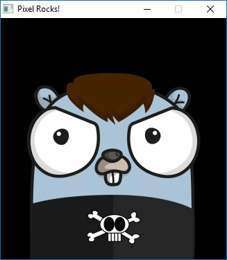
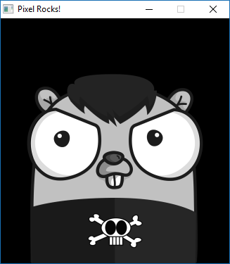
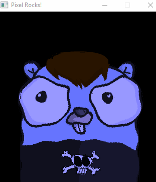

[Previous Tutorial](./Typing-text-on-the-screen.md)

In this tutorial, we'll learn how to use our own OpenGL fragment shaders in Pixel. It enables us to add incredible graphics effects with the help of GPU.

## Quick introduction

If you are unfamiliar with the concept of a shader program you can think of it as a code that your GPU runs to process the varying stages of rendering.

In Pixel, we are only concerned with the fragment shader. Fragments can be thought of as "pixels" (not accurate, but will work for now). Our shader program will take a fragment in, run it through your shader code, and produce the final fragment that will be rendered to the screen.

There are several fantastic resources out there to learn more about shaders [learnopengl.com shaders](https://learnopengl.com/Getting-started/Shaders).

## Basic usage

To demonstrate Pixel's shader API and to some extent what a fragment shader does, we're going to start with a minimal boilerplate Pixel game. This game will load an image from the `"../assets"` directory and draw it to the window. The `gameloop` function was added for clarity.

```go
package main

import (
	"image/png"
	"os"

	"github.com/gopxl/pixel/v2"
	"github.com/gopxl/pixel/v2/backends/opengl"
)

var gopherimg *pixel.Sprite

func gameloop(win *opengl.Window) {
	for !win.Closed() {
                win.Clear(pixel.RGB(0, 0, 0))
        	gopherimg.Draw(win, pixel.IM.Moved(win.Bounds().Center()))
		win.Update()
	}
}

func run() {
	cfg := opengl.WindowConfig{
		Title:  "Pixel Rocks!",
		Bounds: pixel.R(0, 0, 325, 348),
		VSync:  true,
	}
	win, err := opengl.NewWindow(cfg)
	if err != nil {
		panic(err)
	}
	f, err := os.Open("../assets/images/thegopherproject.png")
	if err != nil {
		panic(err)
	}
	img, err := png.Decode(f)
	if err != nil {
		panic(err)
	}
	pd := pixel.PictureDataFromImage(img)
	gopherimg = pixel.NewSprite(pd, pd.Bounds())
	gameloop(win)
}

func main() {
	opengl.Run(run)
}
```

This should simply display our favorite gopher:



## Creating the shader

First things first, we'll need to create our custom shader program. To do so, we'll put the GLSL (GL Shader Language) source code in a string variable.
 
```glsl
var fragmentShader = `
#version 330 core
// The first line in glsl source code must always start with a version directive as seen above.

// vTexCoords are the texture coordinates, provided by Pixel
in vec2  vTexCoords;

// fragColor is what the final result is and will be rendered to your screen.
out vec4 fragColor;

// uTexBounds is the texture's boundries, provided by Pixel.
uniform vec4 uTexBounds;

// uTexture is the actualy texture we are sampling from, also provided by Pixel.
uniform sampler2D uTexture;

void main() {
	// t is set to the screen coordinate for the current fragment.
	vec2 t = (vTexCoords - uTexBounds.xy) / uTexBounds.zw;
	// And finally, we're telling the GPU that this fragment should be the color as sampled from our texture.
	fragColor = texture(uTexture, t);
}
`
```

Explaining the GLSL code is beyond the scope of this tutorial, but, hopefully the comments help enough.

All we need to do to use the shader is to enable it with the [`Canvas.SetFragmentShader`](https://godoc.org/github.com/gopxl/pixel/v2/backends/opengl#Canvas.SetFragmentShader) method. Pixel will take care of the rest:

```go
func gameloop(win *opengl.Window) {
	win.Canvas().SetFragmentShader(fragmentShader)

	for !win.Closed() {
                win.Clear(pixel.RGB(0, 0, 0))
                gopherimg.Draw(win, pixel.IM.Moved(win.Bounds().Center()))
		win.Update()
	}
}
```

The result? Well, it's the same as before because we programmed our fragment shader to simply pass the color straight through.

## Simple grayscale

Let's actually change the image this time. How about we turn the image into grayscale by simply calculating the average of the red, green, and blue color components?

```glsl
var fragmentShader = `
#version 330 core

in vec2  vTexCoords;

out vec4 fragColor;

uniform vec4 uTexBounds;
uniform sampler2D uTexture;

void main() {
	// Get our current screen coordinate
	vec2 t = (vTexCoords - uTexBounds.xy) / uTexBounds.zw;

	// Sum our 3 color channels
	float sum  = texture(uTexture, t).r;
	      sum += texture(uTexture, t).g;
	      sum += texture(uTexture, t).b;

	// Divide by 3, and set the output to the result
	vec4 color = vec4( sum/3, sum/3, sum/3, 1.0);
	fragColor = color;
}
`
```

Hey, check it out! We made it grayscale, completely on the GPU:



## Advanced

Let's try something a little more advanced. I grabbed the shader code we're going to use from https://www.shadertoy.com/view/Xt3fzM. It will provide a _watery distortion effect_.

Most GLSL code is platform specific in some way, so, you'll need to modify it a bit to get it working with Pixel. Here is the Pixel version for reference. **But**, we can't use it yet. The code contains a new concept: uniforms. Hold on a little, we'll explain them in a moment.

```glsl
var fragmentShader = `
#version 330 core

in vec2 vTexCoords;
out vec4 fragColor;

uniform sampler2D uTexture;
uniform vec4 uTexBounds;

// custom uniforms
uniform float uSpeed;
uniform float uTime;

void main() {
    vec2 t = vTexCoords / uTexBounds.zw;
	vec3 influence = texture(uTexture, t).rgb;

    if (influence.r + influence.g + influence.b > 0.3) {
		t.y += cos(t.x * 40.0 + (uTime * uSpeed))*0.005;
		t.x += cos(t.y * 40.0 + (uTime * uSpeed))*0.01;
	}

    vec3 col = texture(uTexture, t).rgb;
	fragColor = vec4(col * vec3(0.6, 0.6, 1.2),1.0);
}
`
```

## Uniforms

You can think of uniforms as global variables that we can set in our game. Pixel supplies a few uniforms by default, but, it also let's us create our own.

In the above GLSL code, we introduced `uSpeed` and `uTime` as custom uniforms. Pixel makes it very easy to change the value of those uniforms.

Define our variables in Go just like normal:

```go
var uTime, uSpeed float32
```

Tell Pixel that we plan to use these two as uniforms:

```go
win.Canvas().SetUniform("uTime", &uTime)
win.Canvas().SetUniform("uSpeed", &uSpeed)
```

Now, each frame our uniform values will be polled and sent to the GPU. Here is the rest of the `gameloop` showing how we update our variables and how we adjust `uSpeed` with the left and right arrow keys:

```go
func gameloop(win *opengl.Window) {
	win.Canvas().SetUniform("uTime", &uTime)
	win.Canvas().SetUniform("uSpeed", &uSpeed)
	uSpeed = 5.0
	win.Canvas().SetFragmentShader(fragmentShader)

	start := time.Now()
	for !win.Closed() {
		win.Clear(pixel.RGB(0, 0, 0))
		gopherimg.Draw(win, pixel.IM.Moved(win.Bounds().Center()))
		uTime = float32(time.Since(start).Seconds())
		if win.Pressed(opengl.KeyRight) {
			uSpeed += 0.1
		}
		if win.Pressed(opengl.KeyLeft) {
			uSpeed -= 0.1
		}
		win.Update()
	}
}
```

## Result



And that's it for now! To grab the full source to each of these examples, check out the [examples repository](https://github.com/gopxl/pixel-examples).