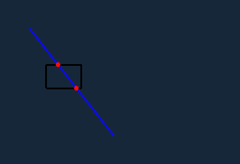

# Line Collisions
Line collisions is a basic example of how to detect line collisions with a rectangle.

## Instructions
You can set the rectangle position using a left-click of the mouse.

You can set the line position with two right-clicks of the mouse; the first right-click will set the beginning of the
line the second will set the end of the line.

Any intersection points where the rectangle and line intersection will appear as red dots. 
