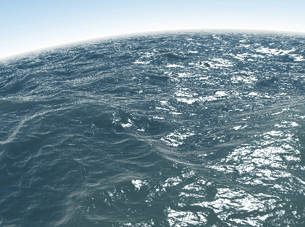

# Shadertoy to Pixel shader conversion

This will show you an example how you can take an example from [shadertoy.com](shadertoy.com) and use it with the Pixel Shader support.

["Seascape" by Alexander Alekseev aka TDM - 2014](https://www.shadertoy.com/view/Ms2SD1) is a nice one. It's very impressive and doesn't use textures so that simplifies things for us. Let's try that one.

Looking at the seascape.glsl example you can see **iResolution**, **iTime** and **iMouse** in there.

These are commonly needed to be exposed because these things are coming from outside and needs to be updated. Any other variable you need to have changed/updated from code can be exposed like those.

## Command line arguments

```
./seascape-shader -h   # will show you the command line options

./seascape-shader -filename ./shaders/seascape.glsl    # Seascape
./seascape-shader -filename ./shaders/planetfall.glsl  # Planet Fall demo
```

## Exposing variables

How to expose variables like this?

Well, first we need to figure out what type of variables they are. Looking at the shader, you can see **iResolution.x** in there. This tells you that it's not a simple type. In this case it's a **vec2***, a **Vector containing 2 values, x and y**. This makes sense since resolution is described by x and y. That is, width and height.

And thus, we create our variable in Go with like so:
```
uResolution := mgl32.Vec2{float32(win.Bounds().W()), float32(win.Bounds().H())}
```
That is, to be of the type **mgl32.Vec2**. Here we create it by taking the window's width and height.

**iTime** is just a float, and thus that is just created like so:
```
var uTime float32
```

For the **iMouse**, it's a **mgl32.Vec4**, a **Vector containing 4 variables**. We only use x and y for the mouse position here though.
```
var uMouse mgl32.Vec4
```

And finally, to make our variables available in the shader itself we use:
```
canvas.SetUniform(name string, value interface{})
```

We create a handy function to do this:

``` go
func EasyBindUniforms(c *pixelgl.Canvas, unifs ...interface{}) {
	if len(unifs)%2 != 0 {
		panic("needs to be divisable by 2")
	}
	for i := 0; i < len(unifs); i += 2 {

		c.SetUniform(unifs[i+0].(string), unifs[i+1])
	}
}
```
and we call that function like so:

``` go
	EasyBindUniforms(canvas,
		"uResolution", &uResolution,
		"uTime", &uTime,
		"uMouse", &uMouse,
	)
```

## Updating shader source file

We also need to do some updates to the shader file itself to match these variables. First thing would be to add the variables we exposed in Go.

```
uniform vec2 uResolution;
uniform float uTime;
uniform vec4 uMouse;
```
Then we just rename the variables to match.

We also need to rename the main function itself, as the one used here is specific for use with shadertoy. For our shader, the entrypoint is main(). So we rename:
```
void mainImage( out vec4 fragColor, in vec2 fragCoord )
```
to
```
void main() {
```


Also, rename:
```
fragCoord
```
to
```
gl_FragCoord
```
because this is available globaly in the OpenGL space for the shader.

We also need to add:
```
out vec4 fragColor;
```

to expose that.

Lastly, we need to add:
```
#version 330 core
```
at the top to tell what version we require.


## Using shader
To use the shader in our canvas we do:
```
canvas.SetFragmentShader(fragSource string)
```
where fragSource is the fragment shader, not a path fo a file.

#

## Result converting shadertoy shader to use with Pixel

Here is a diff of the changes:


And that is it. Running the program we should see this:


