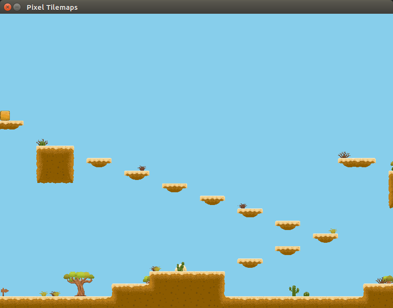

# Pixel Tiles Example
This is a very simple example of how you might load a tilemap generated with [Tiled](https://www.mapeditor.org/) (i.e. a .tmx file), 
in a game with [Pixel](https://github.com/faiface/pixel) for Go.

The tilemap used in this example is humbly borrowed from James Bowman's repo here: [https://github.com/jamesbowman/tiled-maps](https://github.com/jamesbowman/tiled-maps).

## Preview

## Tilemap

