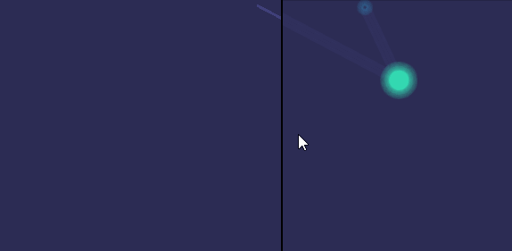
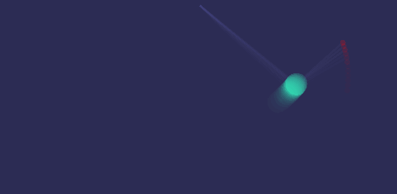

# Examples for Pixel's new custom fragment shader support

A few examples on how to implement custom shaders in Pixel. Please note I am not good with graphics, so hopefully someone more talented than I come up with better demos soon :)

## fast radial blurring effect

## long exposure-ish effect

## grayscale (from wiki tutorial)

## wavy (from wiki tutorial)

